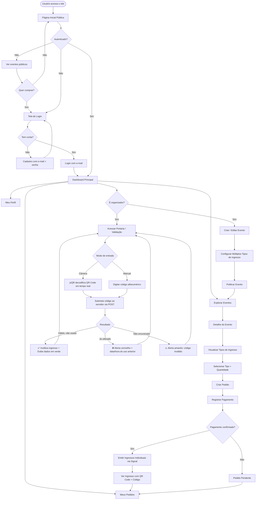
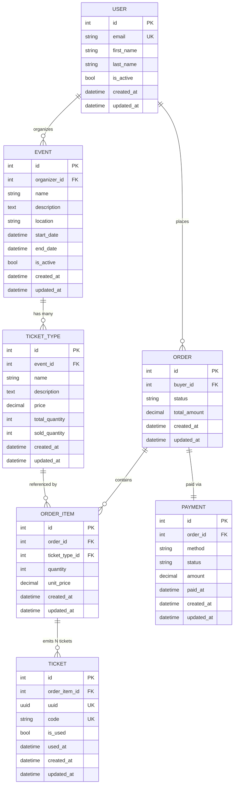

# PRD — Vinil: Sistema de Gestão e Vendas de Ingressos

> **Versão:** 1.1.0
> **Data:** 16/03/2026
> **Status:** Em elaboração

---

## 1. Visão Geral

O **Vinil** é uma plataforma web de gestão e venda de ingressos para eventos, construída com Django full stack. O sistema permite que organizadores criem e gerenciem eventos, definam **múltiplos tipos de ingressos** por evento (ex: Pista, VIP, Camarote), e acompanhem pedidos e pagamentos. Cada ingresso emitido recebe um **QR Code único** e um **código identificador alfanumérico único**, que podem ser validados e inutilizados na entrada do evento — via leitura do QR Code por câmera ou digitação manual do código.

O projeto segue uma arquitetura simples, sem over-engineering, com foco em entrega de valor incremental por sprints bem definidas.

---

## 2. Sobre o Produto

**Nome:** Vinil
**Tipo:** Aplicação web Django full stack
**Banco de dados:** SQLite (padrão Django)
**Frontend:** Django Template Language + TailwindCSS
**Autenticação:** Sistema nativo Django com login via e-mail

O Vinil resolve dois problemas centrais: organizadores precisam de uma ferramenta simples para criar eventos e configurar diferentes categorias de ingressos; e na portaria dos eventos, precisam de uma forma confiável de validar ingressos — seja por câmera lendo QR Code, seja digitando o código manualmente — garantindo que cada ingresso seja usado apenas uma vez.

---

## 3. Propósito

Oferecer uma solução de gestão e venda de ingressos para eventos que seja:

- **Simples de usar** para organizadores e compradores
- **Segura na portaria** com validação única de ingressos por QR Code ou código alfanumérico
- **Flexível** com múltiplos tipos de ingresso por evento
- **Fácil de manter** para desenvolvedores
- **Visualmente agradável** com design moderno, gradiente e identidade harmônica
- **Escalável de forma incremental**, partindo de um MVP enxuto

---

## 4. Público-Alvo

| Perfil | Descrição |
|---|---|
| **Organizador de Eventos** | Pessoa ou empresa responsável pela criação e gestão de eventos e tipos de ingressos |
| **Comprador / Participante** | Usuário final que pesquisa eventos e adquire ingressos |
| **Porteiro / Validador** | Responsável pela entrada do evento que valida e inutiliza os ingressos |
| **Administrador do Sistema** | Usuário com acesso ao Django Admin para gestão geral da plataforma |

---

## 5. Objetivos

1. Permitir o cadastro e autenticação de usuários via e-mail
2. Permitir a criação e publicação de eventos com informações completas
3. Permitir a criação de **múltiplos tipos de ingressos** por evento (ex: Pista, VIP, Camarote), cada um com preço, quantidade e descrição próprios
4. Permitir que compradores adquiram ingressos e gerem pedidos
5. Emitir um **ingresso individual** para cada unidade comprada, com **QR Code único** e **código identificador alfanumérico único**
6. Oferecer uma **página de validação de portaria** onde o ingresso é inutilizado via leitura de QR Code ou digitação do código
7. Registrar pagamentos associados aos pedidos
8. Exibir um site público de apresentação com catálogo de eventos
9. Oferecer um dashboard interno para organizadores
10. Manter rastreabilidade histórica de todas as entidades

---

## 6. Requisitos Funcionais

### 6.1 Autenticação e Contas (`accounts`)

- RF01 — Cadastro de novo usuário com nome, e-mail e senha
- RF02 — Login com e-mail e senha (não username)
- RF03 — Logout
- RF04 — Página de perfil do usuário autenticado

### 6.2 Eventos (`events`)

- RF05 — Listagem pública de eventos ativos
- RF06 — Página de detalhe de um evento com seus tipos de ingressos disponíveis
- RF07 — Criação de evento (organizador autenticado)
- RF08 — Edição de evento
- RF09 — Ativação/desativação de evento

### 6.3 Tipos de Ingresso (`tickets` — TicketType)

- RF10 — Criação de múltiplos tipos de ingresso vinculados a um evento
- RF11 — Cada tipo possui: nome (ex: Pista, VIP), descrição, preço, quantidade total e quantidade vendida
- RF12 — Controle automático de disponibilidade: `disponível = total - vendido`
- RF13 — Um evento pode ter N tipos de ingressos com preços e quantidades independentes

### 6.4 Ingressos Emitidos (`tickets` — Ticket)

- RF14 — A cada item de pedido confirmado, N `Ticket`s individuais são emitidos (onde N = quantidade comprada)
- RF15 — Cada `Ticket` recebe um **UUID único** gerado automaticamente como identificador interno
- RF16 — Cada `Ticket` recebe um **código alfanumérico curto único** no formato `VNL-XXXXX` para digitação manual
- RF17 — Cada `Ticket` tem um **QR Code gerado** a partir do seu código alfanumérico único
- RF18 — O ingresso exibe: evento, tipo de ingresso, nome do comprador, código alfanumérico e QR Code
- RF19 — O ingresso pode ser visualizado em uma página dedicada acessível por link

### 6.5 Pedidos (`orders`)

- RF20 — Criação de pedido por um comprador autenticado
- RF21 — O comprador seleciona um tipo de ingresso e a quantidade desejada
- RF22 — Listagem de pedidos do usuário autenticado
- RF23 — Detalhe de pedido com itens, status e link para cada ingresso emitido

### 6.6 Pagamentos (`payments`)

- RF24 — Registro de pagamento associado a um pedido
- RF25 — Atualização de status do pagamento (pendente, confirmado, cancelado)
- RF26 — Ao confirmar o pagamento, os `Ticket`s individuais são emitidos automaticamente via signal

### 6.7 Validação de Ingresso na Portaria (`tickets` — Validação)

- RF27 — Página de validação acessível apenas a usuários autenticados (organizadores/porteiros)
- RF28 — A página permite **leitura de QR Code via câmera** do dispositivo com decodificação em tempo real
- RF29 — A página permite **digitação manual do código alfanumérico** do ingresso
- RF30 — Ao submeter, o sistema verifica se o ingresso existe, se é válido e se pertence a um evento ativo
- RF31 — Se válido e não utilizado: marca como **utilizado**, registra data/hora e exibe confirmação em verde
- RF32 — Se já utilizado: exibe alerta em vermelho com data/hora da primeira utilização
- RF33 — Se o código não existir: exibe alerta de código inválido
- RF34 — O resultado exibe: nome do evento, tipo do ingresso, nome do comprador e status da operação
- RF35 — Após cada validação, o campo de código é limpo automaticamente para nova leitura

### 6.8 Site Público

- RF36 — Página inicial pública com apresentação do produto
- RF37 — Listagem pública de eventos disponíveis
- RF38 — Links para cadastro e login

### 6.9 Dashboard Interno

- RF39 — Dashboard com resumo de eventos, pedidos, ingressos emitidos e ingressos já validados

---

### 6.10 Flowchart de UX



---

## 7. Requisitos Não-Funcionais

| ID | Requisito | Detalhe |
|---|---|---|
| RNF01 | **Performance** | Páginas devem carregar em menos de 2 segundos em condições normais |
| RNF02 | **Segurança** | Sistema nativo Django com CSRF protection; validação de portaria restrita a autenticados |
| RNF03 | **Responsividade** | Interface responsiva para desktop, tablet e mobile — especialmente a tela de validação |
| RNF04 | **Unicidade de ingresso** | UUID + código alfanumérico garantidos únicos via `unique=True` no banco de dados |
| RNF05 | **Rastreabilidade** | Todos os models com `created_at`, `updated_at` e `HistoricalRecords` via `django-simple-history` |
| RNF06 | **Código limpo** | PEP8, aspas simples, inglês no código, português na interface |
| RNF07 | **Banco de dados** | SQLite padrão Django |
| RNF08 | **Manutenibilidade** | Class Based Views, models ricos, views simples |
| RNF09 | **Concorrência** | `select_for_update()` ao criar pedido para evitar race condition na venda de ingressos |
| RNF10 | **QR Code** | Gerado server-side com `qrcode[pil]` e exibido como imagem base64 no template |

---

## 8. Arquitetura Técnica

### 8.1 Stack

| Camada | Tecnologia |
|---|---|
| **Backend** | Python 3.12+ / Django 5.x |
| **Frontend** | Django Template Language + TailwindCSS (via CDN) |
| **Banco de dados** | SQLite (padrão Django) |
| **Histórico** | `django-simple-history` |
| **QR Code** | `qrcode[pil]` (geração server-side) |
| **Leitura de QR Code** | `jsQR` (biblioteca JavaScript via CDN, roda no browser) |
| **Admin** | Django Admin nativo |
| **Autenticação** | Django Auth nativo com backend customizado (login por e-mail) |

---

### 8.2 Estrutura de Dados



---

### 8.3 Geração do Código Alfanumérico

O código do ingresso segue o formato `VNL-XXXXX`, onde `XXXXX` é uma sequência aleatória de 5 caracteres maiúsculos e dígitos (ex: `VNL-A3K9P`). A geração ocorre no `save()` do model `Ticket`:

```python
import random
import string

def generate_ticket_code():
    chars = string.ascii_uppercase + string.digits
    suffix = ''.join(random.choices(chars, k=5))
    return f'VNL-{suffix}'
```

A unicidade é garantida pelo campo `unique=True`. Em caso de colisão (extremamente rara), o `save()` tenta novamente capturando `IntegrityError`.

---

### 8.4 Geração do QR Code

O QR Code é gerado a partir do **código alfanumérico** do ingresso (não da URL), permitindo validação mesmo offline. A imagem é convertida para base64 e renderizada diretamente no template:

```python
import qrcode
import base64
from io import BytesIO

def get_qrcode_base64(self) -> str:
    qr = qrcode.make(self.code)
    buffer = BytesIO()
    qr.save(buffer, format='PNG')
    return base64.b64encode(buffer.getvalue()).decode('utf-8')
```

Uso no template: ``

---

### 8.5 Fluxo de Validação na Portaria

```
[Browser] → jsQR decodifica frame do vídeo → extrai código alfanumérico
         → preenche campo <input> → submete form via POST
[Server]  → busca Ticket pelo code (case-insensitive)
         → se não existe: result = 'invalid'
         → se is_used == True: result = 'already_used' + used_at
         → se is_used == False: ticket.mark_as_used() → result = 'success'
[Browser] → renderiza bloco de resultado correspondente
         → limpa campo, foca para próxima leitura
```

---

## 9. Design System

Todo o design utiliza **TailwindCSS** dentro do **Django Template Language**, com identidade visual moderna baseada em gradientes, fundos claros e tipografia limpa. Todos os componentes são implementados como partials reutilizáveis em `templates/components/`.

---

### 9.1 Paleta de Cores

| Token | Classe Tailwind | Hex | Uso |
|---|---|---|---|
| **Primary** | `violet-600` | `#7c3aed` | Ações principais, botões primários |
| **Primary Dark** | `violet-800` | `#5b21b6` | Hover de primário |
| **Secondary** | `fuchsia-500` | `#d946ef` | Gradiente, destaques |
| **Accent** | `pink-400` | `#f472b6` | Badges, tags |
| **Background** | `slate-50` | `#f8fafc` | Fundo geral das páginas |
| **Surface** | `white` | `#ffffff` | Cards, modais, formulários |
| **Border** | `slate-200` | `#e2e8f0` | Bordas suaves |
| **Text Primary** | `slate-800` | `#1e293b` | Texto principal |
| **Text Muted** | `slate-400` | `#94a3b8` | Labels, placeholders |
| **Success** | `emerald-500` | `#10b981` | Ingresso válido, confirmações |
| **Warning** | `amber-400` | `#fbbf24` | Alertas, pendente |
| **Danger** | `rose-500` | `#f43f5e` | Ingresso já usado, erros |

**Gradiente padrão:**
```html
class="bg-gradient-to-br from-violet-600 via-fuchsia-500 to-pink-400"
```

---

### 9.2 Tipografia

| Elemento | Classes Tailwind |
|---|---|
| **Título de página** | `text-3xl font-bold text-slate-800 tracking-tight` |
| **Subtítulo** | `text-xl font-semibold text-slate-700` |
| **Corpo** | `text-base text-slate-600 leading-relaxed` |
| **Label de campo** | `text-sm font-medium text-slate-700` |
| **Texto muted** | `text-sm text-slate-400` |
| **Código de ingresso** | `font-mono text-2xl font-bold tracking-widest text-violet-700` |
| **Link** | `text-violet-600 hover:text-violet-800 underline-offset-2 hover:underline` |

**Fonte base:** Inter (via Google Fonts)
```html
<link href="https://fonts.googleapis.com/css2?family=Inter:wght@400;500;600;700&display=swap" rel="stylesheet">
<style> body { font-family: 'Inter', system-ui, sans-serif; } </style>
```

---

### 9.3 Botões

```html
<!-- Primário -->
<button class="inline-flex items-center gap-2 px-5 py-2.5 rounded-xl
               bg-gradient-to-r from-violet-600 to-fuchsia-500
               text-white font-semibold text-sm shadow-md
               hover:from-violet-700 hover:to-fuchsia-600
               transition-all duration-200 active:scale-95">
  Ação Principal
</button>

<!-- Secundário (outline) -->
<button class="inline-flex items-center gap-2 px-5 py-2.5 rounded-xl
               border border-violet-300 text-violet-700 font-semibold text-sm
               bg-white hover:bg-violet-50 transition-all duration-200 active:scale-95">
  Ação Secundária
</button>

<!-- Danger -->
<button class="inline-flex items-center gap-2 px-5 py-2.5 rounded-xl
               bg-rose-500 text-white font-semibold text-sm
               hover:bg-rose-600 transition-all duration-200 active:scale-95">
  Cancelar
</button>

<!-- Success (validação) -->
<button class="inline-flex items-center gap-2 px-5 py-2.5 rounded-xl
               bg-emerald-500 text-white font-semibold text-sm
               hover:bg-emerald-600 transition-all duration-200 active:scale-95">
  Validar Ingresso
</button>
```

---

### 9.4 Inputs e Formulários

```html
<div class="flex flex-col gap-1">
  <label class="text-sm font-medium text-slate-700">Código do Ingresso</label>
  <input type="text"
         class="w-full px-4 py-2.5 rounded-xl border border-slate-200
                bg-white text-slate-800 placeholder-slate-400 font-mono uppercase
                focus:outline-none focus:ring-2 focus:ring-violet-400 focus:border-transparent
                transition-all duration-150"
         placeholder="VNL-XXXXX">
  <span class="text-xs text-rose-500">Código não encontrado.</span>
</div>

<!-- Form container padrão -->
<form class="bg-white rounded-2xl shadow-sm border border-slate-100 p-6 flex flex-col gap-5">
  <!-- campos aqui -->
</form>
```

---

### 9.5 Card de Ingresso (visualização / impressão)

```html
<div class="bg-white rounded-2xl shadow-lg border border-slate-100 overflow-hidden max-w-sm mx-auto">
  <!-- Header gradiente -->
  <div class="bg-gradient-to-r from-violet-600 to-fuchsia-500 p-5 text-white">
    <p class="text-xs font-semibold uppercase tracking-widest opacity-80">🎵 Vinil</p>
    <h2 class="text-xl font-bold mt-1">Nome do Evento</h2>
    <p class="text-sm opacity-90 mt-0.5">São Paulo · 25 de Abril de 2026</p>
  </div>
  <!-- Corpo -->
  <div class="p-5 flex flex-col items-center gap-4">
    
    <span class="font-mono text-2xl font-bold tracking-widest text-violet-700">
      {{ ticket.code }}
    </span>
    <div class="w-full border-t border-slate-100 pt-4 flex flex-col gap-1 text-sm text-slate-600">
      <div class="flex justify-between">
        <span class="text-slate-400">Tipo</span>
        <span class="font-semibold text-slate-800">{{ ticket.order_item.ticket_type.name }}</span>
      </div>
      <div class="flex justify-between">
        <span class="text-slate-400">Titular</span>
        <span class="font-semibold text-slate-800">{{ ticket.order_item.order.buyer.get_full_name }}</span>
      </div>
    </div>
  </div>
  <!-- Status -->
  <div class="bg-rose-50 border-t border-rose-100bg-emerald-50 border-t border-emerald-100 px-5 py-3 text-center">
    
      <span class="text-rose-700 font-semibold text-sm">❌ Utilizado em {{ ticket.used_at|date:'d/m/Y \à\s H:i' }}</span>
    
      <span class="text-emerald-700 font-semibold text-sm">✅ Válido</span>
    
  </div>
</div>
```

---

### 9.6 Cards de Tipo de Ingresso (na página do evento)

```html
<div class="bg-white rounded-2xl border border-slate-100 shadow-sm p-5 flex flex-col gap-3
            hover:shadow-md transition-shadow duration-200">
  <div class="flex items-start justify-between">
    <div>
      <h3 class="text-lg font-bold text-slate-800">VIP</h3>
      <p class="text-sm text-slate-500 mt-0.5">Área exclusiva com open bar</p>
    </div>
    <span class="text-violet-700 font-bold text-xl">R$ 250,00</span>
  </div>
  <div class="flex items-center justify-between pt-2 border-t border-slate-100">
    <span class="text-sm text-slate-400">48 disponíveis</span>
    <a href="#" class="px-4 py-2 rounded-xl bg-gradient-to-r from-violet-600 to-fuchsia-500
                       text-white text-sm font-semibold hover:opacity-90 transition-opacity">
      Comprar
    </a>
  </div>
</div>

<!-- Tipo esgotado -->
<div class="bg-slate-50 rounded-2xl border border-slate-100 p-5 flex flex-col gap-3 opacity-60">
  <div class="flex items-start justify-between">
    <div>
      <h3 class="text-lg font-bold text-slate-600">Pista</h3>
      <p class="text-sm text-slate-400 mt-0.5">Área geral</p>
    </div>
    <span class="text-slate-500 font-bold text-xl">R$ 80,00</span>
  </div>
  <div class="flex items-center justify-between pt-2 border-t border-slate-100">
    <span class="inline-flex items-center px-2.5 py-0.5 rounded-full text-xs font-semibold bg-rose-100 text-rose-700">Esgotado</span>
    <button disabled class="px-4 py-2 rounded-xl bg-slate-200 text-slate-400 text-sm font-semibold cursor-not-allowed">
      Indisponível
    </button>
  </div>
</div>
```

---

### 9.7 Tela de Validação de Portaria

```html
<!-- Feedback: Ingresso válido -->
<div class="bg-emerald-50 border border-emerald-200 rounded-2xl p-6 flex flex-col gap-2">
  <p class="text-emerald-700 font-bold text-lg">✅ Ingresso válido!</p>
  <p class="text-emerald-600 text-sm">Evento: Rock no Parque · Tipo: VIP</p>
  <p class="text-emerald-600 text-sm">Titular: Alessandro Souza</p>
  <p class="text-emerald-500 text-xs mt-1">Ingresso inutilizado com sucesso.</p>
</div>

<!-- Feedback: Já utilizado -->
<div class="bg-rose-50 border border-rose-200 rounded-2xl p-6 flex flex-col gap-2">
  <p class="text-rose-700 font-bold text-lg">❌ Ingresso já utilizado</p>
  <p class="text-rose-600 text-sm">Utilizado em: 25/04/2026 às 19:42</p>
</div>

<!-- Feedback: Código inválido -->
<div class="bg-amber-50 border border-amber-200 rounded-2xl p-6 flex flex-col gap-2">
  <p class="text-amber-700 font-bold text-lg">⚠️ Código inválido</p>
  <p class="text-amber-600 text-sm">Nenhum ingresso encontrado com este código.</p>
</div>
```

---

### 9.8 Badges de Status

```html
<span class="inline-flex items-center px-2.5 py-0.5 rounded-full text-xs font-semibold bg-emerald-100 text-emerald-700">Confirmado</span>
<span class="inline-flex items-center px-2.5 py-0.5 rounded-full text-xs font-semibold bg-amber-100 text-amber-700">Pendente</span>
<span class="inline-flex items-center px-2.5 py-0.5 rounded-full text-xs font-semibold bg-rose-100 text-rose-700">Cancelado</span>
<span class="inline-flex items-center px-2.5 py-0.5 rounded-full text-xs font-semibold bg-violet-100 text-violet-700">Utilizado</span>
<span class="inline-flex items-center px-2.5 py-0.5 rounded-full text-xs font-semibold bg-slate-100 text-slate-600">Não utilizado</span>
```

---

### 9.9 Navbar Pública

```html
<nav class="sticky top-0 z-50 bg-white/80 backdrop-blur-md border-b border-slate-100 shadow-sm">
  <div class="max-w-7xl mx-auto px-4 sm:px-6 lg:px-8 flex items-center justify-between h-16">
    <a href="/" class="text-xl font-bold bg-gradient-to-r from-violet-600 to-fuchsia-500
                       bg-clip-text text-transparent">🎵 Vinil</a>
    <div class="flex items-center gap-3">
      <a href="/login/" class="text-sm text-slate-600 hover:text-violet-600 font-medium transition-colors">Entrar</a>
      <a href="/cadastro/" class="px-4 py-2 rounded-xl bg-gradient-to-r from-violet-600 to-fuchsia-500
                                  text-white text-sm font-semibold hover:opacity-90 transition-opacity">
        Cadastre-se
      </a>
    </div>
  </div>
</nav>
```

---

### 9.10 Sidebar (Dashboard Interno)

```html
<aside class="w-64 min-h-screen bg-gradient-to-b from-slate-900 to-violet-950
              text-white flex flex-col py-6 px-4 gap-1 shadow-xl">
  <div class="mb-6 px-2">
    <span class="text-xl font-bold bg-gradient-to-r from-violet-300 to-fuchsia-300
                 bg-clip-text text-transparent">🎵 Vinil</span>
  </div>
  <!-- item ativo -->
  <a href="#" class="flex items-center gap-3 px-3 py-2.5 rounded-xl
                     bg-violet-600/30 text-violet-200 font-medium text-sm">
    📊 Dashboard
  </a>
  <!-- itens padrão -->
  <a href="#" class="flex items-center gap-3 px-3 py-2.5 rounded-xl
                     text-slate-400 hover:text-white hover:bg-white/10 font-medium text-sm transition-all">
    🎪 Meus Eventos
  </a>
  <a href="#" class="flex items-center gap-3 px-3 py-2.5 rounded-xl
                     text-slate-400 hover:text-white hover:bg-white/10 font-medium text-sm transition-all">
    🛒 Meus Pedidos
  </a>
  <a href="#" class="flex items-center gap-3 px-3 py-2.5 rounded-xl
                     text-slate-400 hover:text-white hover:bg-white/10 font-medium text-sm transition-all">
    🎟️ Meus Ingressos
  </a>
  <a href="#" class="flex items-center gap-3 px-3 py-2.5 rounded-xl
                     text-slate-400 hover:text-white hover:bg-white/10 font-medium text-sm transition-all">
    🚪 Validar Ingresso
  </a>
  <a href="#" class="flex items-center gap-3 px-3 py-2.5 rounded-xl
                     text-slate-400 hover:text-white hover:bg-white/10 font-medium text-sm transition-all mt-auto">
    👤 Perfil
  </a>
  <a href="/logout/" class="flex items-center gap-3 px-3 py-2.5 rounded-xl
                            text-rose-400 hover:text-white hover:bg-rose-600/30 font-medium text-sm transition-all">
    🚪 Sair
  </a>
</aside>
```

---

### 9.11 Layout Base

```html
<!DOCTYPE html>
<html lang="pt-BR">
<head>
  <meta charset="UTF-8">
  <meta name="viewport" content="width=device-width, initial-scale=1.0">
  <title>Vinil</title>
  <script src="https://cdn.tailwindcss.com"></script>
  <link href="https://fonts.googleapis.com/css2?family=Inter:wght@400;500;600;700&display=swap" rel="stylesheet">
  <style> body { font-family: 'Inter', system-ui, sans-serif; } </style>
  
</head>
<body class="bg-slate-50 text-slate-800 antialiased">
  
  <main class="min-h-screen">
    
    
  </main>
  
  
</body>
</html>
```

---

## 10. User Stories

### Épico 1 — Autenticação e Conta

**US01 — Cadastro de usuário**
> Como visitante, quero me cadastrar com nome, e-mail e senha para ter acesso à plataforma.

**Critérios de Aceite:**
- [ ] Formulário com campos: nome, e-mail, senha e confirmação de senha
- [ ] E-mail deve ser único; duplicidade retorna erro inline
- [ ] Senhas com menos de 8 caracteres são rejeitadas
- [ ] Após cadastro, usuário é redirecionado para o login

---

**US02 — Login com e-mail**
> Como usuário cadastrado, quero fazer login com e-mail e senha para acessar o sistema.

**Critérios de Aceite:**
- [ ] O campo de login aceita e-mail (não username)
- [ ] Credenciais inválidas exibem mensagem de erro clara
- [ ] Após login, usuário é redirecionado ao dashboard

---

**US03 — Logout**
> Como usuário autenticado, quero fazer logout para encerrar minha sessão.

**Critérios de Aceite:**
- [ ] Botão de logout visível na sidebar
- [ ] Sessão encerrada; redirecionamento para página inicial pública

---

### Épico 2 — Eventos

**US04 — Listar eventos públicos**
> Como visitante, quero ver eventos disponíveis para decidir se quero comprar ingressos.

**Critérios de Aceite:**
- [ ] Eventos ativos exibidos em grid de cards
- [ ] Cada card exibe: nome, data, local e menor preço entre os tipos disponíveis
- [ ] Eventos inativos ou sem nenhum tipo de ingresso não aparecem

---

**US05 — Detalhe do evento com tipos de ingresso**
> Como visitante, quero ver os detalhes de um evento e todos os tipos de ingressos disponíveis.

**Critérios de Aceite:**
- [ ] Página exibe: nome, descrição, data, local
- [ ] Seção de ingressos lista **todos os tipos** com nome, descrição, preço e disponibilidade
- [ ] Tipos esgotados exibem badge "Esgotado" e botão desabilitado
- [ ] Botão "Comprar" redireciona para login se não autenticado

---

**US06 — Criar evento**
> Como organizador, quero criar um evento e depois adicionar quantos tipos de ingresso quiser.

**Critérios de Aceite:**
- [ ] Formulário de evento com campos básicos
- [ ] Após criar o evento, posso adicionar N tipos de ingresso com nome, preço e quantidade próprios

---

### Épico 3 — Tipos de Ingresso

**US07 — Criar tipo de ingresso**
> Como organizador, quero adicionar tipos de ingresso ao meu evento para que os compradores possam escolher entre categorias.

**Critérios de Aceite:**
- [ ] Formulário com: nome, descrição, preço, quantidade total
- [ ] Tipo vinculado ao evento; quantidade vendida começa em zero
- [ ] Pode existir mais de um tipo por evento simultaneamente

---

**US08 — Editar tipo de ingresso**
> Como organizador, quero editar um tipo de ingresso para corrigir preço ou quantidade.

**Critérios de Aceite:**
- [ ] Formulário de edição pré-preenchido
- [ ] Não é possível reduzir `total_quantity` abaixo do `sold_quantity` atual

---

### Épico 4 — Pedidos e Ingressos Emitidos

**US09 — Realizar pedido**
> Como comprador autenticado, quero selecionar um tipo de ingresso e quantidade para criar um pedido.

**Critérios de Aceite:**
- [ ] Comprador seleciona tipo de ingresso e quantidade
- [ ] Sistema verifica disponibilidade antes de criar (sem race condition)
- [ ] Pedido criado com status "pendente"

---

**US10 — Ver ingressos emitidos com QR Code**
> Como comprador, quero ver meus ingressos após confirmar o pagamento, com o QR Code e o código único de cada um.

**Critérios de Aceite:**
- [ ] Após confirmação, um `Ticket` individual emitido por unidade comprada
- [ ] Cada ingresso exibe: evento, tipo, nome do comprador, código alfanumérico (`VNL-XXXXX`) e QR Code
- [ ] Página do ingresso acessível por link único
- [ ] O QR Code codifica o código alfanumérico do ingresso

---

**US11 — Ver meus pedidos**
> Como comprador, quero listar todos os meus pedidos com status e link para os ingressos.

**Critérios de Aceite:**
- [ ] Lista com: evento, data do pedido, valor total, status
- [ ] Link para detalhe do pedido com itens e ingressos emitidos
- [ ] Badges coloridos por status

---

### Épico 5 — Pagamentos

**US12 — Registrar pagamento**
> Como comprador, quero registrar o pagamento de um pedido para confirmar minha compra e receber os ingressos.

**Critérios de Aceite:**
- [ ] Formulário com método de pagamento e valor
- [ ] Ao confirmar: `order.status` atualizado e ingressos individuais emitidos via signal
- [ ] Redirecionamento para página de sucesso com links para os ingressos

---

### Épico 6 — Validação de Portaria

**US13 — Validar ingresso por QR Code**
> Como porteiro, quero ler o QR Code do ingresso com a câmera do celular para validá-lo na entrada do evento.

**Critérios de Aceite:**
- [ ] Página acessa câmera do dispositivo via browser (jsQR)
- [ ] QR Code decodificado extrai o código alfanumérico e submete ao servidor
- [ ] Ingresso válido: inutilizado, exibe confirmação verde com dados (evento, tipo, titular)
- [ ] Ingresso já usado: alerta vermelho com data/hora do uso anterior
- [ ] Código inválido: alerta amarelo

---

**US14 — Validar ingresso por código digitado**
> Como porteiro, quero digitar o código alfanumérico manualmente caso a câmera não esteja disponível.

**Critérios de Aceite:**
- [ ] Campo de texto na mesma tela, letras convertidas para maiúsculas automaticamente
- [ ] Submissão via botão ou Enter
- [ ] Mesmo fluxo de resultado: válido / já usado / inválido
- [ ] Campo limpo automaticamente após cada validação para nova entrada

---

## 11. Métricas de Sucesso

### KPIs de Produto

| KPI | Descrição | Meta Inicial |
|---|---|---|
| Eventos ativos | Quantidade de eventos publicados | ≥ 5 no MVP |
| Tipos por evento | Média de categorias de ingresso configuradas | ≥ 2 por evento |
| Taxa de conversão | % de visitantes que criam conta | ≥ 15% |
| Pedidos completados | Pedidos com pagamento confirmado / total | ≥ 60% |
| Ingressos validados | % de ingressos utilizados na portaria | Referência para fraude |
| Tentativas inválidas | Validações com código inválido | < 2% do total |

### KPIs de Usuário

| KPI | Descrição | Meta |
|---|---|---|
| Cadastros | Novos usuários por semana | ≥ 10 no MVP |
| Retenção | Usuários que retornam após a primeira compra | ≥ 30% |
| Pedidos por usuário | Média de pedidos por usuário ativo | ≥ 1.5 |

### KPIs Técnicos

| KPI | Descrição | Meta |
|---|---|---|
| Tempo de resposta | Latência média das páginas principais | < 500ms |
| Unicidade de código | Colisões de código alfanumérico | 0 |
| Erros em produção | Exceptions não tratadas por semana | 0 |

---

## 12. Riscos e Mitigações

| Risco | Probabilidade | Impacto | Mitigação |
|---|---|---|---|
| Race condition ao comprar (dois usuários compram o último ingresso) | Média | Alto | `select_for_update()` ao decrementar `sold_quantity` |
| Colisão de código alfanumérico | Muito baixa | Alto | Campo `unique=True` + retry automático na geração em `save()` |
| QR Code forjado / screenshot reutilizado | Média | Alto | Validação server-side com inutilização imediata no primeiro uso |
| Câmera indisponível na portaria | Média | Médio | Campo de digitação manual sempre disponível na mesma tela |
| Ingressos emitidos sem pagamento confirmado | Baixa | Alto | `Ticket`s só criados no signal após `Payment.status == 'confirmado'` |
| Signal de emissão executado mais de uma vez | Baixa | Alto | Verificar `created=False` no signal e `is_used` antes de criar |
| Expansão prematura de escopo | Alta | Médio | PRD funciona como contrato de escopo; sprints validadas antes de iniciar |

---


*— Fim do PRD — Vinil v1.1.0*